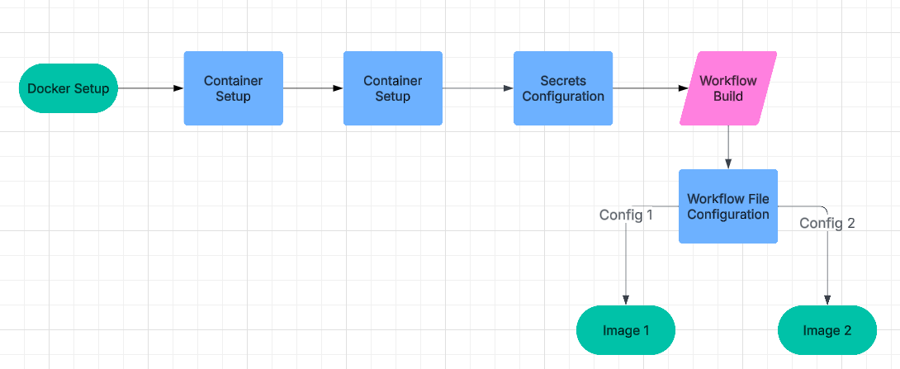

# Project 4
Written By: Brennan Burke

Goal: The goal of this project is to properly create a docker image as well as use the dockerhub repository and github repository in tandem. 

Tools Used in this Project:
        - Docker Desktop: Allowed the usage of Docker commands in command line.
        - Github: Area to store information and create a README file.
        - Ubuntu: OS used to run the commands used for the project.
        - DockerHub: Website used to adjust settings of Docker account.
        - angular-site Resources: Template for the creation of the docker image.
        - Lucid Charts: Creation of the Diagram provided.

Diagram: 

## Part 1
1. Setting up Docker
    - Visit the Docker website and click "Download Docker Desktop". https://www.docker.com/get-started/
    - Once installed, open Docker Desktop, sign in, then go to settings. Go to the resources tab, then the WSL integration tab. Make sure "Enable integration with my default WSL distro" is checked. (You can also Enable             integration with a distro that you use, such as Ubuntu)
    - Make sure WSL2 is installed on your system. This can be done by doing ` wsl -l -v ` then following up with `wsl --install` if it is not installed.
    - Make sure Docker is installed correctly by using the command `docker --version` then doing a test command such as `docker run hello-world`.
2. Setting up a container
   - Run the docker container command, it should look something like this `docker run -it --rm -p 4200:4200 -v $(pwd)/angular-site/wsu-hw-ng-main:/usr/src/app -w /usr/src/app node:18-bullseye bash` The pathway might differ slightly but it should look roughly the same.
       - Using the tag `-it` makes the terminal interactable after running.
       - `--rm` will make the container remove itself after exiting.
       - `-p 4200:4200` maps port 4200 on the container to port 4200 on the local host.
       - `-v $(pwd)/angular-site/wsu-hw-ng-main:/usr/src/app` will mount the container from the host device to the container.
       - `-w /usr/src/app` will place the angular-site directory inside of the `/usr/src/app` directory.
       - `bash` will run the bash shell inside of the container.
    - Command used for dependencies installed inside of the container:
          - `npm install -g @angular/cli`
    - Command used to run the application inside of the container:
          - `ng serve --host 0.0.0.0`
    - Validating the container is properly hosting:
          - From the container side, run `docker logs <container_id>` for example my container id was b03eb93e3d0c, so I would run `docker logs b03eb93e3d0c`
          - From the local host side, go to your browser and open the link `http://localhost:4200`, if "Birds gone wild" appears, then it has properly connected.

3. Utilizing Dockerfile and Images
   - Dockerfile explanation:
         - FROM node:18-bullseye: Uses the Node.js base image.
         - WORKDIR /usr/src/app: Sets the working directory of angular-site inside the container to /user/src/app.
         - COPY . .: Copies the Angular app into the container.
         - RUN npm install -g @angular/cli: Installs all required dependencies needed for Angular.
         - CMD ["npm", "run", "start"] Runs the Angular app when the container starts.
   - How to build an image from the Dockerfile repository:
        - I ran the command `docker build -t edgyduck/burke-ceg3120:latest .`
   - How to run a container from this image:
        - I ran the command `docker run -it --rm -p 4200:4200 -v $(pwd)/angular-site/wsu-hw-ng-main:/usr/src/app -w /usr/src/app node:18-bullseye bash` to run a container.
   - Validating the container is properly hosting:
        - From the container side, run `docker logs <container_id>` for example my container id was b03eb93e3d0c, so I would run `docker logs b03eb93e3d0c`
        - From the local host side, go to your browser and open the link `http://localhost:4200`, if "Birds gone wild" appears, then it has properly connected.
     
4. Using the DockerHub Repository
   - How to create a public repository in Dockerhub:
        - Go to Dockerhub, then click "Create Repository", then name it <YOURLASTNAME>-CEG3120
   - How to authenticate login to Dockerhub:
        - Enter the command `docker login` and it should redirect you to Dockerhub, I actually had an error and had to manually copy and paste the given code into Dockerhub after pasting the link.
   - How to push your image onto Dockerhub:
        - Run `docker tag node:18-bullseye <yourusername>/<YOURLASTNAME>-CEG3120:latest` to tag the image.
        - Then run `docker push <yourusername>/<YOURLASTNAME>-CEG3120:latest`to push the image.
   - Link to my Dockerhub Repository:
        - https://hub.docker.com/repository/docker/edgyduck/burke-ceg3120/general
## Part 2
1. How to configure the GitHub repository secrets
   - First, log in to Docker on your browser.
   - Click on your profile icon, then go to Account settings, which should take you to the Account Information tab.
   - Next, click on Personal Access Tokens, then click generate new token. You will then need to give it a proper name and scope. Set the scope to Read & Write.
   - Make sure to keep note of the password for the token, keep it safe as you cannot see this again once you move on.
  
2. Github Actions
   - My workflow builds and pushes a Docker image to DockerHub whenever a commit is pushed to the main branch of the repository.
   - Workflow explanation:
     - First, the name of the image will be set to edgyduck Docker Image.
     - Then, a piece of code gets triggered any time something is committed and pushed to the main branch.
     - After, a job called `Build and Push` will be defined that runs on Ubuntu.
     - Next, the repository code is downloaded onto the Image runner so that the code can be used.
     - Afterwards, the secrets folder will be utilized with DOCKER_USERNAME and DOCKER_TOKEN, letting you login to Docker.
     - Finally, the Image is built using the root folder and is then pushed to DockerHub.

3.  Verifying that these steps worked
    - You can test the workflow by making a commit to your main branch, then checking the Actions tab in the repository, if the action appeared then it works.
    - You can test your Docker Image by pulling your image locally `docker pull <username>/<image>:latest` then running it `docker run --rm <username>/<image>:latest`
      
## Resources
1. Used links provided in the Project4 README.md file.
